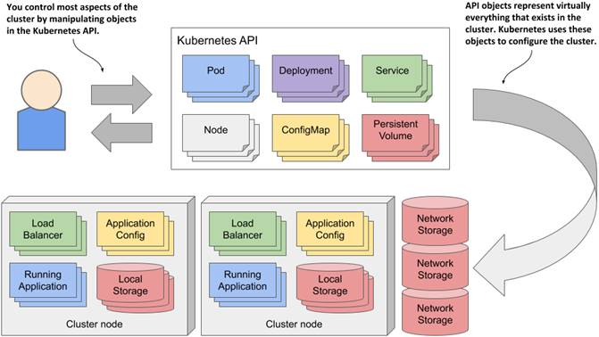
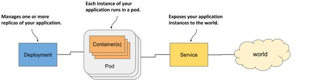
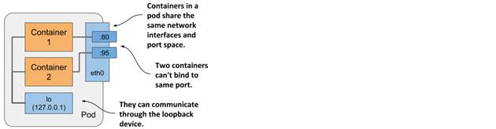

= Kubernetes in Action 2nd

== Links

- https://camel.apache.org/components/2.x/kubernetes-component.html[Apache Camel Kubernetes API]
- https://github.com/Apress/cloud-native-integration-apache-camel[Cloud Native Integration with Apache Camel Git Source]

== Minishift OC env Configuration
* OC command in Minishift cluster env is the same kubectl command in K8's cluster

[source,bash]
----
minishift oc-env
eval $(minishift oc-env)
----

== Introduction the Kubernetes API using Apache Camel Kubernetes API

.A K8s cluster objects

* They include the applications running in the cluster, their configuration, the load balancers through which they are exposed within the cluster or externally, the underlying servers and the storage used by these applications, the security privileges of users and applications, and many other details of the infrastructure.
* The collection of all deployments in the cluster is a REST resource exposed at ##/api/v1/deployments##
* The Kubernetes Control Plane runs several components called controllers that manage the objects you create.
Each controller is usually only responsible for one object type.
For example, the Deployment controller manages Deployment objects.

[source,bash]
----
kubectl get notes
kubectl get node localhost -o yaml
----

* To use API we need expose the api

[source,bash]
----
kubectl proxy
----

== Running Application in Pods

.Three basic object types comprising a deployed application

. World -> Service -> Pods <- -> Deployment

. Pod object, represents the ##central and most important concept in K8s## - a running instance of your application, pod is a co-located group of containers and the basic building block in Kubernetes, in the K8s we don't deploy containers but groups of them managed as a single unit, ##When a Pod has multiple containers, all of them run on the same worker node##, a single pod instance never spans multiple nodes,
. Containers are _designed_ to run only a single process, to take full advantage of the features provided by the container runtime, you should consider running only one process in each container.
. With a pod, you can run closely related processes together, giving them (almost) the same environment as if they were all running in a single container, all containers in a pod share the same Network namespace and thus the network interfaces, IP address(es) and port space that belong to it.
Because of the shared port space, processes running in containers of the same pod can’t be bound to the same port numbers, All the containers in a pod also see the same system hostname.
. Each pod can be considered as separated vCPu/Cpu, avoid stuffing all your applications into a single pod, you should divide them so that each pod runs only closely related application processes.
. ##Kubernetes does not replicate containers within a pod.
It replicates the entire pod.##
. You never need to combine multiple applications in a single pod

.Containers in a pod sharing the same Network namespace

=== Sidecar Containers

. Several containers in a single pod is only appropriate if the application consists of a primary process and one or more processes that complement the operation of the primary process.

.Sidecar Container in same Pod
image::architecture/thumbs/sidecar.png[]

. Before recipes in minikube cluster

[source, bash]
----
# oc
kubectl create namespace k8s-inaction
kubectl config set-context --current --namespace=k8s-inaction
# get current ns
kubectl config view --minify -o jsonpath='{..namespace}'
kubectl get all,pvc,configmap,rolebindings,clusterrolebindings,secrets,sa,roles,clusterroles,crd -l 'app=my-label'
----

=== Create/Handle Pod Object

[source,bash]
----
oc apply -f pod-kiada.yaml
oc get pod kiada
oc describe pod kiada
oc get events
oc get pod kiada -o wide
oc run --image=curlimages/curl -it --restart=Never --rm client-pod curl {{IP_POD}}:8080
oc port-forward kiada 8080
oc logs kiada
oc logs kiada -f
oc logs kiada --timestamps=true
oc logs kiada --since=2m
oc logs kiada --since-time=2020-02-01T09:50:00Z
oc exec kiada -- ps aux
oc exec kiada -- curl -s localhost:8080
oc exec kiada curl -s localhost:8080
oc exec -it kiada -- bash
oc attach kiada
oc attach -i kiada-stdin # version two using stdin image

oc port-forward kiada-ssl 8080 8443 990
oc logs kiada-ssl -c kiada
oc logs kiada-ssl --all-containers
oc get pods -w # watch status changing

oc delete po kiada
oc delete po --all
oc delete -f pod.kiada.yaml,pod.kiada-ssl.yaml
----

=== Copying files to and from containers

[source, bash]
----
oc cp kiada:html/index.html /tmp/index.html
oc cp /tmp/index.html kiada:html/
----

== Sidecar pattern

.Sidecar pattern One Pod Two Containers
image::architecture/thumbs/sidecarpattern.png[]

[source, bash]
----
curl https://example.com:8443 --resolve example.com:8443:127.0.0.1 --cacert kiada-ssl-proxy-0.1/example-com.crt
----

== Pod Lifecycles

[source, bash]
----
oc get po kiada -o yaml | grep phase
oc get pods -n myproject
oc describe po kiada
oc get po kiada -o json | jq .status.conditions
[{
    "lastProbeTime": null,
    "lastTransitionTime": "2020-02-02T11:42:59Z",
    "status": "True",
    "type": "Initialized"
  }]
oc get po kiada -o json | jq .status
oc get pods -w
oc get events -w
oc logs kiada-liveness -c kiada -f
oc exec kiada-liveness -c envoy -- tail -f /tmp/envoy.admin.log
curl -X POST localhost:9901/healthcheck/fail
----

* restartPolicy - default #_Always_# | #_OnFailure_# | #_Never_#

. Lifecycle hoos, pre-start and pre-stop
